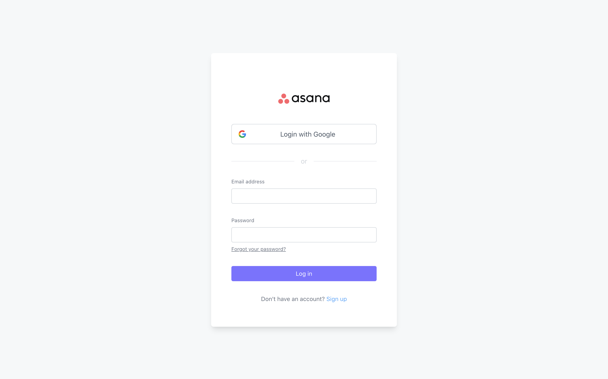
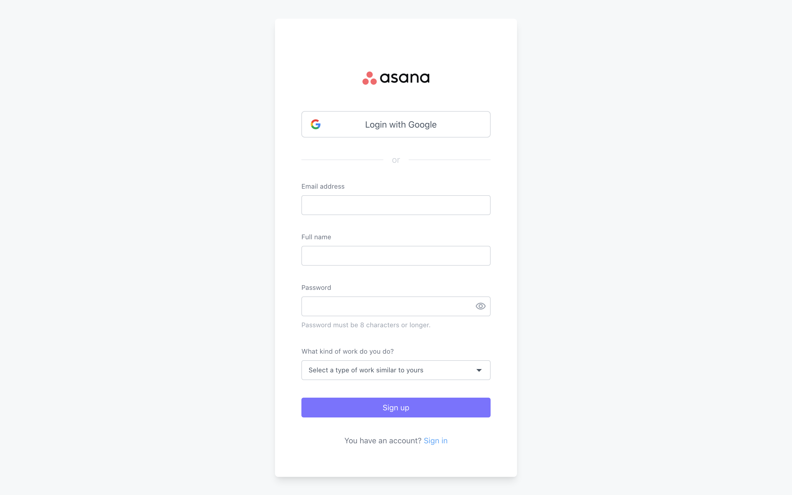
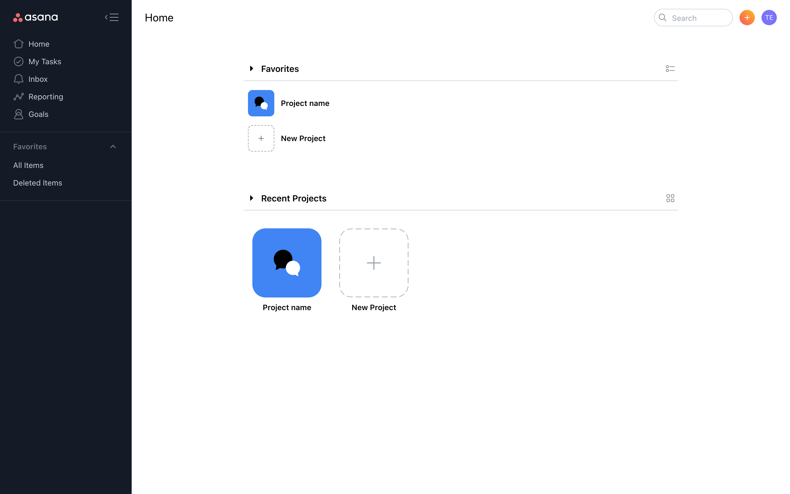
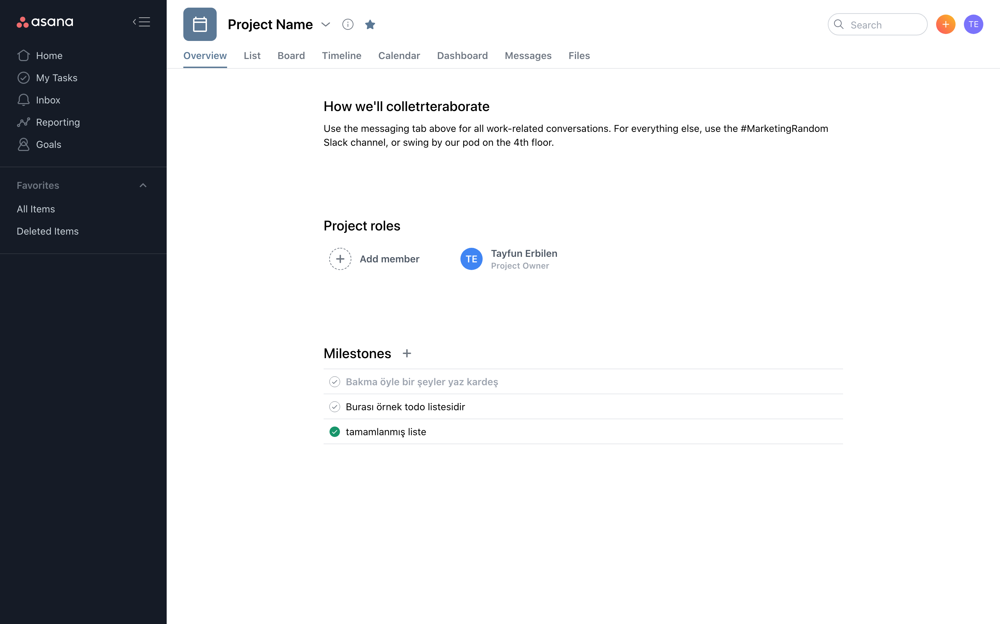
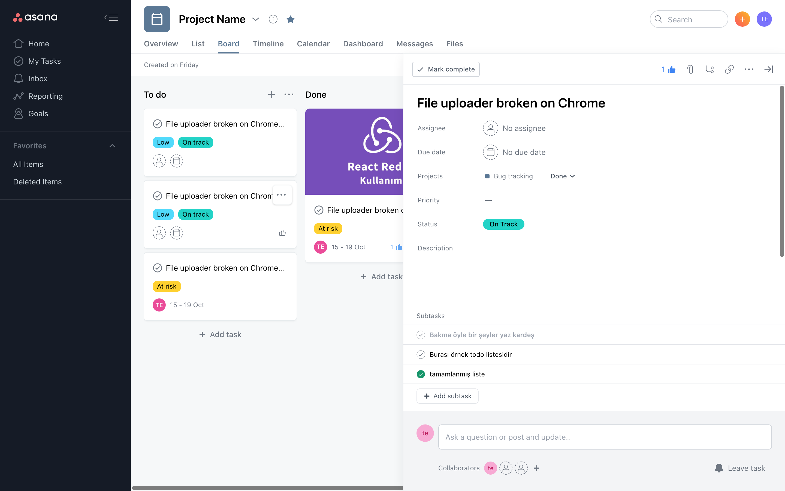

## Asana Tailwind Clone

Sevgili dostum gökhan kandemir (kablosuzkedi), youtube'da asana'nın full-stack bir klonunu yapıyor. Banada ön yüzünün html-css'i için rica etti, ben de seve seve tailwind'i kullanarak bir klon oluşturdum. Herhangi bir javascript çatısı kullanmadım çünkü kendisi bunu vuejs'e geçirecek zaten.

Seriyi merak edip görmemiş olanlar için:
[https://www.youtube.com/watch?v=zdSj1xVyC2Q](https://www.youtube.com/watch?v=zdSj1xVyC2Q)

## Demo

#### Login Ekranı

#### Register Ekranı

#### Dashboard Ekranı

#### Project Overview Ekranı

#### Project Board Ekranı

